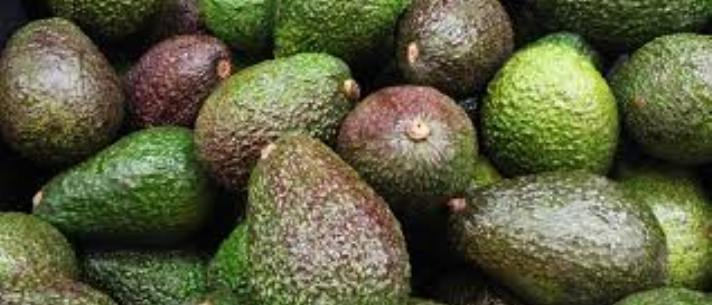

# EDA-and Avocado-Type-Prediction

Exploratory Data Analysis and Type Prediction for Avocado Dataset based on Machine Learning

  <h2>Table of Contents</h2>
  <li>Problem Statement</li>
  <li>Data Loading and Description</li>
  <li>Data Profiling
  <li>Data Visualisation
  <li>Feature Engineering for Model building</li>
  <li>Model selection/prediction</li>
  <li>Conclusion</li>

<h2>Problem Statement</h2>
<ul>
<li>The notebooks explores the basic use of Pandas and will cover the basic commands of (EDA) for analysis purpose.</li>

<li>In this study, we will try to see if we can predict the Avocado’s Type(organic/not) based on different features. The features are different (Total Bags,Date,Type,Year,Region…).</li>

The variables of the dataset are the following:
<li>Categorical: ‘region’,’type’</li>
<li>Date: ‘Date’</li>
<li>Numerical:’Total Volume’, ‘4046’, ‘4225’, ‘4770’, ‘Total Bags’, ‘Small Bags’,’Large Bags’,’XLarge Bags’,’Year’</li>
<li>Target:‘Type’</li>
</ul>

<h2>Data Loading and Description</h2>

This data was downloaded from kaggle, from the Hass Avocado Board website in May of 2018 & compiled into a single CSV.
Represents weekly 2018 retail scan data for National retail volume (units) and price.
The dataset comprises of 18249 observations of 14 columns. Below is a table showing names of all the columns and their description.

The unclear numerical variables terminology is explained here:

<table>
  <tr><th>Features</th><th>Description</th></tr>
  <tr><td>‘Unamed: 0’</td><td>	Its just a useless index feature that will be removed later</td></tr>
  <tr><td>‘Total Volume’</td><td>	Total sales volume of avocados</td></tr>
  <tr><td>‘4046’</td><td>	Total sales volume of Small/Medium Hass Avocado</td></tr>
  <tr><td>‘4225’</td><td>	Total sales volume of Large Hass Avocado</td></tr>
  <tr><td>‘4770’</td><td>	Total sales volume of Extra Large Hass Avocado</td></tr>
  <tr><td>‘Total Bags’</td><td>	Total number of Bags sold</td></tr>
  <tr><td>‘Small Bags’</td><td>	Total number of Small Bags sold</td></tr>
  <tr><td>‘Large Bags’</td><td>	Total number of Large Bags sold</td></tr>
  <tr><td>‘XLarge Bags’</td><td>	Total number of XLarge Bags sold</td></tr>
</table>

[Link for the Jupyter notebook](./AvocadosTypeDetection.ipynb)

