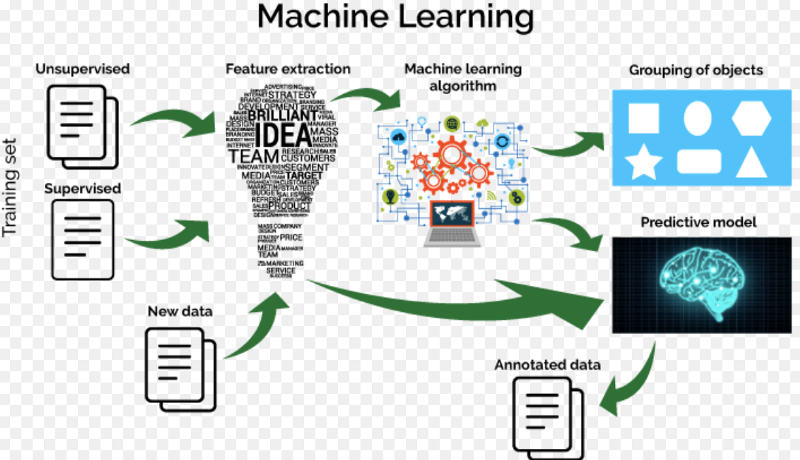
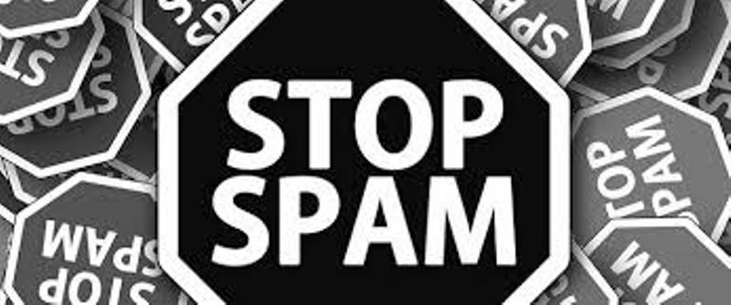

# MachineLearningWithPython
  
Machine Learning is a latest __buzzword__ floating around. It desrves to, as it is one of the most interesting subfield of Computer Science. 
__What does Machine Learning really means?__ 
Machine Learning is an application of artificial intelligence(AI) that provides systems the ability  to automatically learn and improve from experience without being explicitly programmed. 
__Machine Learning focuses on the development of computer programs__ that can access data and use it to learn for themsleves. 
The process of learning begins with data, such as, direct experience, or instruction, in order to look for patterns in data and make better decisions in the future based on the examples that we provide. __The primary aim is to allow the computers learn automatically__ without human intervention or assistance and adjust actions accordingly.

## Repository Overview
This repository is about different Machine Learning algorithm approaches as per the industry practices.

## Table of Contents
- [Exploring Movie Data](#section1) 
- [Spam Detection](#section2) 
- [Avocados Type Prediction](#section3) 
- [Credit Fraud Detection](#section4) 
- [Employee Attrition Analytics](#section5) 
- [FIFA2018 Man Of The Match Prediction](#section6) 

___

### [Exploring Movie Data](./MoviesAnalytics)
  
- A commercially successful movie not only entertains an audience but also enables filmmakers to generate significant profits.
- Several factors such as good directors, experienced actors, and release time are important for profitability, but they do not 
  always guarantee how highly a movie will be rated.
- Have you ever watched a movie you liked and thought about the different factors that make it successful?
- In this project, we sought to understand temporal patterns affecting movie profitability, see how popular genres change over 
  years, identify important actors and directors, and observe changes in movie ratings and vote averages over time.
- [Link for the Jupyter notebook](./MoviesAnalytics/Movie_data_analysis.ipynb)
 
 
___

### [Spam Detection](./SpamDetection)
  
- This is a beginner's example of __document classification__ task which involves __classifying__ an email as spam or not spam mail.
- Spam box in your __Gmail account__ is the best example of this.
- [Link for the Jupyter notebook](./SpamDetection/SpamDetection.ipynb)

___

### [Avocados Type Prediction](./AvocadosTypePrediction)
  
- It is a well known fact that Millenials LOVE Avocado Toast, also is a known fact that all Millenials live in their parents basements.
- Clearly, they aren't buying home because they are buying too much Avocado Toast! :p
- Although avocados might be currently trending among millennials, they aren’t decreasing in popularity anytime soon.
- Lets makes an effort to find the place where Millenial could find cheap avocados and could live out the Millenail American dream.
- [Link for the Jupyter notebook](./AvocadosTypePrediction/AvocadosTypeDetection.ipynb)

___

### [Credit Fraud Detection](./CreditCardFraudDetection)
  
- Credit card fraud is a wide-ranging term for __theft__ and __fraud committed__ using or involving a payment card, such aas credit or     debit card, as  __fraudulent source__ of funds in a transaction. 
- The purpose may be to obtain goods without paying, or to obtain __unautorized funds from an account__.
- Credit card fraud is also and adjunt to __identity__ theft.
- Building a robust model so that credit card companies are able to recognize the fraudulent card transactions so that customets are not   charged for items that they did not purchase.
- [Link for the Jupyter notebook](./CreditCardFraudDetection/CreditFraud.ipynb)

___

### [Employee Attrition Prediction](./EmployeeAttritionAnalytics)
  
- Every year a lot of companies hire a number of employees. The companies __invest__ time and money in __training__ those employees, 
  not just this but there are __training programs__ within the companies for their existing employees as well. The __aim__ of these       programs is to __increase the effectiveness__ of their employees.  
- Lets understand the factors which are most important to employees and if are not fulfilled might lead to Attrition.
- [Link for the Jupyter notebook](./EmployeeAttritionPrediction/EmployeeAttrition.ipynb)

___

### [FIFA2018 Man Of The Match Prediction](./FIFA2018_Statistics)
  
- Machine learning is an interesting technology that is traditionally used to predict the outcome of events.  
- Now, machine learning is being applied beyond its traditional use cases , can be used to predict the outcome of major sporting events    instead of relying on clairvoyant animals, groundless naysayers, or sports pundits.
- While most of the earlier predictions have been relying on unscientific methods — such as the popular __Paul the Octopus__ that         magically predicted the 2010 World Cup winner (Spain) — Artificial intelligence scientists have also entered the prediction bandwagon,   this time round.
- An effort to build the model that __predict Man of the Match__ for an very exciting, unpredictable sporting activity __“Football(FIFA   2018 World Cup)”__ 
- [Link for the Jupyter notebook](./FIFA2018_Statistics/FIFA2018_Analysis.ipynb)

